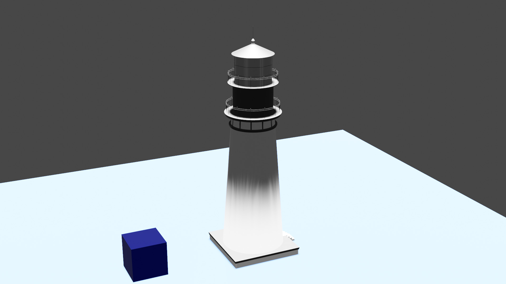
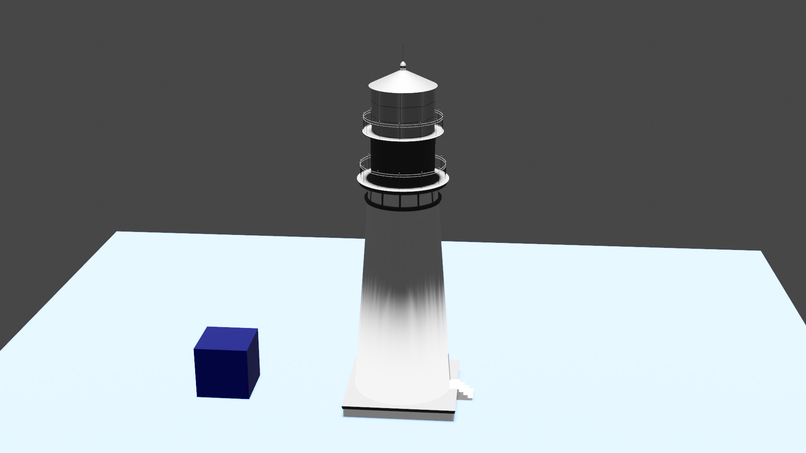

# Blender automation

This repo contains some experiments on how to automate image generation with blender.

## example1.py

Based on:
https://gist.github.com/armindocachada/3466586d1b0b9cb20a826310f9a3e14d

Changes:

- Load external model (source: https://www.freepolygon.com/en/architecture/lighthouse)
- More light
- Additional tracking object for cam

### Usage

Run headless blender to execute script.
`blender -b --python example1.py`

### Result:

* 
* 
